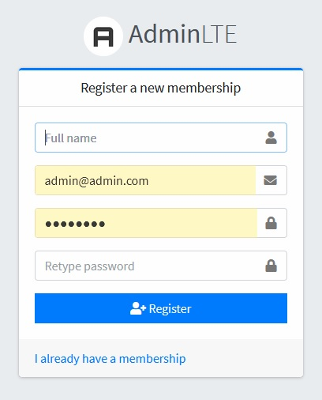
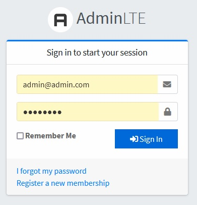
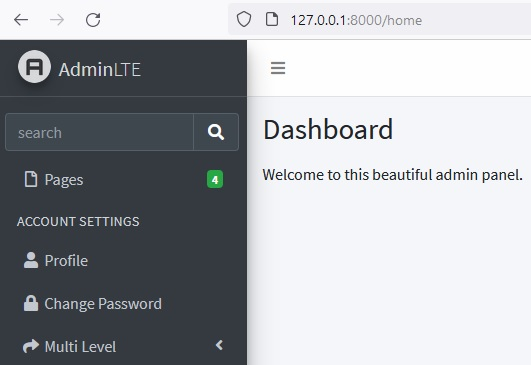

<p align="center"><a href="https://laravel.com" target="_blank"></a></p>

## get it up and running.

After you clone this project, do the following:

``` bash
1. go into the project 
    cd laravel-admin-lte

2. install composer dependencies 
    composer install
    or
    composer update

3. generate a key for your application 
    php artisan key:generate

4. create a .env file
    cp .env.example .env

5. create a local MySQL database (make sure you have MySQL up and running) 
    mysql -u root -p
    
    > create database db_name;
    > exit;

6. add the database connection config to your .env file
    DB_CONNECTION=mysql
    DB_DATABASE=db_name
    DB_USERNAME=root
    DB_PASSWORD=

7. run the migration files to generate the schema 
   php artisan migrate

8. install npm dependencies 
   npm install && npm run dev

9. php artisan serve 
   Visit http://127.0.0.1:8000 your browser
````   
   
   
   